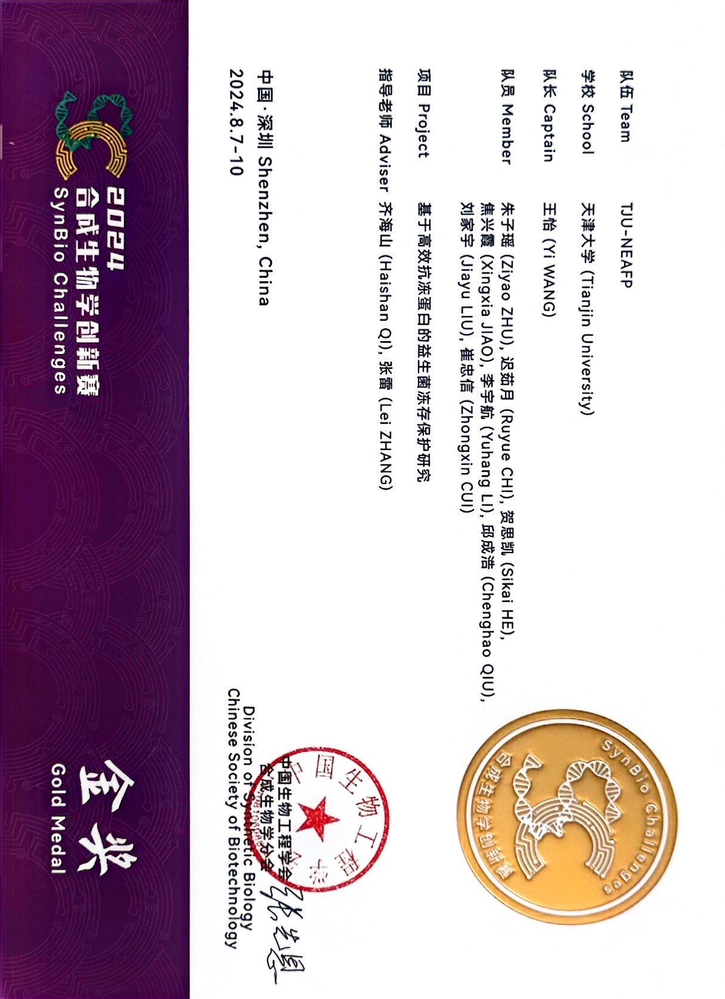
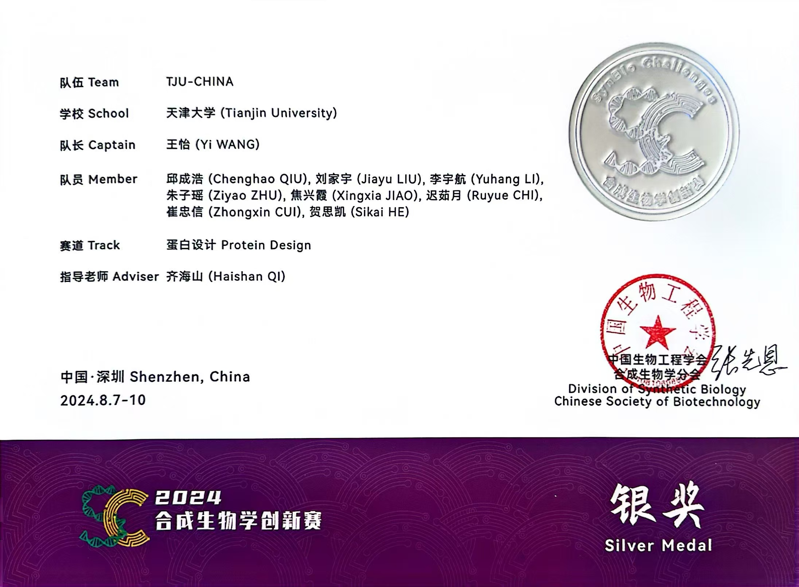

# 天津大学——蛋白质设计大赛

## 基于 BERT 的深度学习方法：荧光蛋白强度的预测与进化

## 一、 简介

本项目旨在通过文献综述和深度学习技术，识别并进化荧光蛋白关键突变位点，并基于 BERT 架构精确预测荧光强度。在广泛的文献查询识别荧光蛋白中的关键突变位点基础上，结合最新的深度学习技术进行预测与进化。项目通过训练 ProteinBERT 模型来实现这一目标，将优化后的荧光蛋白强度数据集分为训练集、验证集和测试集，并使用自定义回调函数记录和绘制训练过程中的性能指标，最终使用该模型进行准确预测。该方法不仅提高了预测精度，还为荧光蛋白设计和应用提供了新的思路。

### 单位：天津大学

### 作者：TJU-CHINA

指导老师：齐海山
小组成员：王怡 邱成浩 刘家宇 李宇航 朱子瑶 焦兴霞 迟茹月 崔忠信 贺思凯

### 代码参考

本项目基于 ProteinBERT 项目进行开发，ProteinBERT 源地址[ProteinBERT_Github] (https://github.com/nadavbra/protein_bert)
原项目 README.md 文件存储在`origin_README.md`中，以便于查看

### 环境配置

开发时使用 conda 环境已经导出，详见`environment.yml`

## 二、使用教程

**建议参考 usage.ipynb 笔记本文件**

### 1. 准备数据集

```bash
cd data
```

**在 data 文件夹中准备你需要的数据，分别为训练集和测试集**

在示例 data 中已经准备有相应的 python 脚本来辅助数据的处理

- `to_CSV.py` 将 excel 转化为 csv 文件
- `apply_mutations_CSV.py` 将突变信息转化为全序列信息
- `split.py` 以比例划分原始文件形成 train 和 test

在示例 data 中存储了两个版本的数据集（均进行了相应的划分）

- `GFP_data_with_full_sequences` 赛事主办方提供的数据，包含四种类型的荧光蛋白以及其突变信息与荧光分数
- `test` 取上述数据集的小样本，以便于测试代码各项功能

### 2. 进行微调

**微调代码储存在主目录下`FT.py`中**

- 在代码中可以调整训练、微调、最终轮数，不同的训练轮数和批量大小会显著影响训练的时间和质量
- 代码中增加了自定义回调函数，旨在每个 epoch 结束后测试其`MSE`与`MAE`作为性能指标
- 微调结束之后，整个模型（包括结构和权重）会保存在`./saved_model`路径

### 3. 加载模型并进行预测

**预测数据准备**

```bash
cd predict
```

`predict`文件夹中包含`predict_data`与 `predict_result`
其中`predict_data`包含需要测试的序列
`predict_result`为最终的结果输出

**预测代码储存在主目录下`predict.py`中**

- 在代码中可以调整进行预测的批量大小，这回影响预测的速度和消耗的资源
- 预测结束之后程序会在控制台打印相应的结果并且存储到`./predict/predict_result/predictions.csv`中

### 4. 筛选预测结果

文献筛选 + 数据分析

### 5. 结果

阈值为 0.1 下的模型准确率为: 76.97%

finalEpoch : MSE = 0.09233837334031302, MAE = 0.1775578759648998

## 三、比赛结果
**2024合成生物学创新赛——常规赛**


**2024合成生物学创新赛——蛋白质设计赛**
